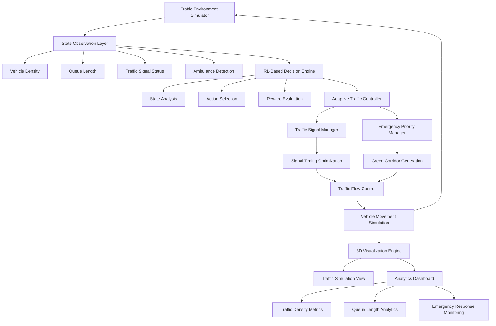
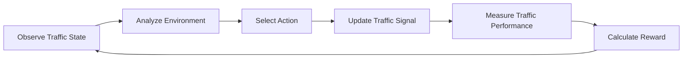
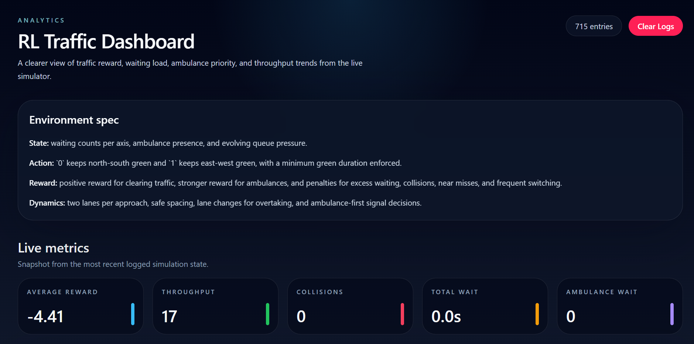

<div align="center">

# 🚦 Ambulance-Priority Traffic Signal Control System


### 🧠 AI-Powered Adaptive Traffic Signal Optimization with Emergency Vehicle Prioritization

An intelligent traffic management platform that dynamically controls traffic signals using Reinforcement Learning-inspired decision-making, prioritizes ambulances during emergencies, and visualizes traffic flow through an immersive 3D simulation environment.

### 🌐 Live Web App

🔗 https://3-d-reinforcement-based-traffic-lig.vercel.app/traffic

</div>


https://github.com/user-attachments/assets/1131f126-a5ba-433a-ad9c-453bb2a062e9


---

# 📖 Overview

Urban traffic congestion is one of the most pressing challenges in modern cities. Traditional traffic signals operate on fixed timing schedules and fail to adapt to changing traffic conditions, resulting in congestion, increased waiting times, fuel wastage, and delayed emergency response.

The **Ambulance-Priority Traffic Signal Control System** introduces an intelligent adaptive traffic management approach using Reinforcement Learning concepts. The system continuously observes traffic conditions, optimizes signal timings, prioritizes ambulances, and visualizes traffic behavior in a real-time 3D environment.

This project demonstrates how AI-driven transportation systems can improve road efficiency and emergency response while supporting future smart city infrastructure.

---

# 🎯 Problem Statement

Traditional traffic management systems suffer from:

- Fixed signal timing schedules
- Poor congestion handling
- Lack of emergency vehicle prioritization
- Increased waiting times
- Inefficient traffic distribution
- Limited adaptability to real-time conditions

These limitations can significantly impact transportation efficiency and emergency response effectiveness.

---

# 💡 Proposed Solution

The system introduces an adaptive traffic signal controller capable of:

### 🧠 Traffic State Monitoring

The controller continuously analyzes:

- Vehicle density
- Queue lengths
- Traffic congestion levels
- Signal states
- Ambulance presence
- Road occupancy

### ⚡ Dynamic Traffic Optimization

Based on current traffic conditions, the system:

- Adjusts signal timings dynamically
- Reduces waiting times
- Improves intersection throughput
- Balances traffic flow
- Minimizes congestion

### 🚑 Emergency Vehicle Prioritization

When an ambulance enters the intersection:

1. Ambulance is detected
2. Traffic conditions are evaluated
3. Current signal sequence is overridden
4. Green corridor is generated
5. Ambulance receives immediate passage
6. Normal traffic operation resumes

---

# 🏗️ System Architecture



---

# 🔄 Reinforcement Learning Workflow



---

# 🧠 Reinforcement Learning Logic

The system follows the RL-inspired workflow:

```text
State → Action → Environment → Reward → State
```

### State Space

The agent observes:

- Vehicle density
- Queue lengths
- Traffic congestion
- Current signal state
- Ambulance presence

### Action Space

The controller can:

- Extend green signal duration
- Switch signal phases
- Maintain current signal
- Trigger emergency priority mode

### Reward Function

#### Positive Rewards

- Reduced waiting times
- Improved traffic throughput
- Faster ambulance movement
- Efficient signal utilization

#### Negative Rewards

- Traffic congestion
- Long queues
- Ambulance delays
- Inefficient signal switching

---

# ✨ Key Features

## 🧠 Intelligent Traffic Signal Control

- Adaptive signal optimization
- RL-inspired decision engine
- Dynamic traffic management
- Congestion-aware signal handling

## 🚑 Ambulance Priority System

- Emergency vehicle detection
- Signal preemption logic
- Green corridor generation
- Faster emergency response support

## 🌐 Interactive 3D Visualization

- Real-time traffic simulation
- Dynamic vehicle movement
- Signal state rendering
- Immersive WebGL environment

## 📊 Analytics Dashboard

- Traffic density monitoring
- Queue length analytics
- Signal state tracking
- Emergency response metrics
- Performance monitoring

## ⚡ Real-Time Simulation

- Continuous state updates
- Dynamic traffic behavior
- Live signal transitions
- Responsive visualization

---
# 📸 Project Preview

## Traffic Simulation


## Ambulance Priority Mode


## Dashboard



## Dashboard Metrics


---

# 📂 Project Structure

```text
3D-RL-Traffic-Signal-Control-System
│
├── app/
│   └── traffic/
│
├── components/
│   └── traffic/
│       ├── ClientTrafficSim.tsx
│       ├── ErrorBoundary.tsx
│       ├── three-scene.tsx
│       ├── traffic-sim-app.tsx
│       └── use-traffic-sim.ts
│
├── public/
│   └── rl-sim/
│       └── scripts/
│           └── rl_env.py
│
├── lib/
├── package.json
├── tsconfig.json
├── tailwind.config.js
└── README.md
```

---
# 🛠️ Technology Stack

| Category | Technologies |
|-----------|-------------|
| 🎨 Frontend | Next.js, React, TypeScript, Tailwind CSS |
| 🗂️ State Management | Zustand |
| 🧩 UI Components | Radix UI, React Hook Form, Zod |
| 🌐 Visualization | React Three Fiber, Three.js, WebGL, Recharts |
| 🧠 AI & Simulation | Reinforcement Learning Concepts, Traffic Environment Simulator, State-Action-Reward Logic, Emergency Vehicle Priority Engine, Python RL Environment |
| 🚀 Deployment | Vercel, GitHub |

---

# ⚙️ Installation

## Prerequisites

- Node.js 18+
- npm
- Git

### Clone Repository

```bash
git clone https://github.com/Keerthishreekesavan/3D-Reinforcement-based-traffic-light-control-system-with-ambulance-priority
```

### Navigate to Project Directory if in case of Nested

```bash
cd 3D-RL-Traffic-Signal-Control-System
```

### Install Dependencies

```bash
npm install
```

### Run Development Server

```bash
npm run dev
```

### Open Browser

```text
http://localhost:3000
```

---

# 📈 System Capabilities

| Feature | Status |
|----------|---------|
| Adaptive Traffic Signal Simulation | ✅ |
| RL-Based Decision Logic | ✅ |
| Ambulance Prioritization | ✅ |
| Interactive 3D Environment | ✅ |
| Traffic Flow Optimization | ✅ |
| Analytics Dashboard | ✅ |
| Real-Time Updates | ✅ |
| Emergency Signal Preemption | ✅ |

---

# 🔒 Safety Features

- Collision-aware vehicle movement
- Emergency signal override
- Safe signal transitions
- Dynamic traffic state validation
- Congestion-aware optimization
- Real-time monitoring

---

# 🚀 Future Enhancements

## 🧠 Advanced Reinforcement Learning

- Deep Q-Network (DQN)
- Proximal Policy Optimization (PPO)
- Multi-Agent Reinforcement Learning
- Self-learning signal controllers

## 🌐 Smart City Integration

- IoT traffic sensor integration
- Cloud-based analytics
- Edge AI deployment
- Smart infrastructure connectivity

## 🚦 Advanced Traffic Networks

- Multi-intersection traffic management
- City-scale traffic simulation
- Route prediction systems
- Intelligent traffic routing

## 📱 Platform Expansion

- Mobile dashboard support
- Traffic authority control center
- Alert and notification systems
- Remote monitoring platform

---

# 📊 Impact & Applications

This project demonstrates how intelligent transportation systems can:

- Reduce traffic congestion
- Improve emergency response times
- Optimize urban traffic flow
- Support smart city initiatives
- Improve transportation efficiency
- Enhance road safety

### Potential Applications

- Smart Cities
- Intelligent Transportation Systems (ITS)
- Emergency Response Networks
- Urban Traffic Management
- Transportation Research

---

# 👩‍💻 Author

## Keerthishree Kesavan 🌷

AI & Machine Learning Engineering Student

### Connect With Me

- GitHub: https://github.com/Keerthishreekesavan
- LinkedIn: https://www.linkedin.com/in/keerthishreekesavan/

---

# 📄 License

Licensed under the MIT License.

See the LICENSE file for more information.

---

# ⭐ Support

If you found this project useful:

- ⭐ Star the repository
- 🍴 Fork the project
- 🐛 Report issues
- 🚀 Contribute improvements

---

<div align="center">

## 🚦 Building Smarter Roads with AI

### Reinforcement Learning • Emergency Vehicle Prioritization • Smart Transportation • 3D Simulation

</div>
